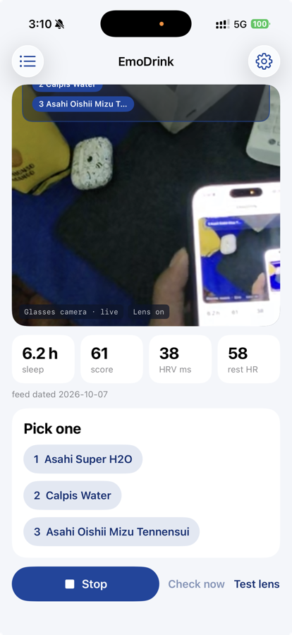
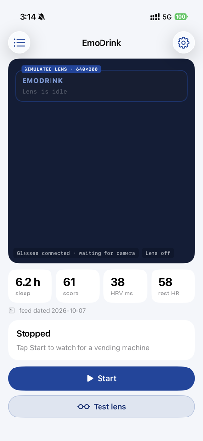

# EmoDrink Glasses

Three drinks, picked from how you slept, offered the moment you reach the
vending machine. On **Meta Ray-Ban Display** glasses, or an iPhone alone in
phone mode. In Japanese or English.

EmoDrink Glasses continues the [EmoDrink](https://dl.acm.org/doi/full/10.1145/3795011.3797399)
work (Augmented Humans 2026, AHLab with Asahi as the study's industry
partner): a physiological signal is only useful at the moment a person can
act on it. The study did that in a Quest 3 with a room-anchored virtual
machine. This does it on glasses, in the real world, hands-free, in a few
seconds. Built as a thank-you for Taka, who ran the study and lent the
glasses.

It is a fork of [Hermes Glasses](https://github.com/prasanthsasikumar/hermes-glasses),
MIT licensed, cut down to EmoDrink alone. Everything else Hermes does
lives on in the Hermes Glasses repo.

<p align="center">
  
</p>

<p align="center">
  
  &nbsp;&nbsp;
  
</p>
<p align="center"><em>Left: first run on the glasses, the stage showing the Ray-Ban Display camera live while the lens offers three drinks. Right: the home before Start. A video at a real machine in Singapore is coming.</em></p>

## First ten minutes

1. **Install.** Build from Xcode onto the iPhone. The bundle id
   (`com.flowsxr.hermesglasses`) must be the one registered with the Meta
   Wearables Developer Center, and `Config/Secrets.xcconfig` must carry the
   Meta app id and the assistant key (copy `Config/Secrets.example.xcconfig`).
2. **Glasses.** In the Meta AI app (v272 or later, glasses firmware v125 or
   later), put the glasses on, open Settings › App Info and tap App Version
   five times for Developer Mode, then press **Install** to put the Device
   Access Toolkit on the glasses (accept the Wi-Fi prompt). Pair them from
   EmoDrink (Settings › Glasses › Connect glasses), allow the glasses camera
   when Meta AI asks, and allow local network access when iOS asks: the lens
   uses a Wi-Fi link. No glasses on you? Phone mode uses the iPhone camera.
3. **Check the two basics.** Settings › Glasses › Developer › Glasses basics
   has three tests built straight from Meta's samples: send text to the lens,
   show the glasses camera on the phone, and run the vending machine check
   with the answer on the lens. If any of these fails, nothing else will work.
4. **Permissions.** Allow each prompt as it comes: microphone and speech
   recognition (to pick by voice), camera (to see the machine), Bluetooth and
   local network (to reach the glasses), and location and motion (device
   context for the assistant: where you are, the weather, walking or still).
5. **Start watching.** Tap **Start** on the home screen (it also starts by
   itself when the app opens). The lens shows "Drink mode", "Watching for a
   vending machine" and a hint to say "what should I drink" /
   「何を飲めばいい」. At a machine it shows three numbered drinks; pick one by
   tap, number or name, then "Why" / 「なぜ」 or "Thanks" / 「ありがとう」.
6. **A better voice.** On the iPhone, Settings › Accessibility › Spoken
   Content › Voices › Japanese › Kyoko (Enhanced), and an Enhanced English
   voice under English. EmoDrink uses the best one installed.
7. **Phone in a pocket.** Use headset mode ("Headset Mic", Settings › Language and
   voice › Microphone): the lens stays free and the mic still hears you. The
   glasses' own mic brings up their call screen over the lens.
8. **The data.** The default feed is a fixed sample document, so the card
   reads "feed dated ..." for it. Turn on "Use sample data" (Settings ›
   Drinks) for an offline demo, or point the feed URL at your own data.
9. **The budget.** At most 150 vision checks an hour, sent only when the
   scene changes and settles. Settings › Drinks shows how many are used.

## What it does

- **Opens watching.** The app starts the session and drink mode by itself
  ("Watch for vending machines when the app opens", Settings › Drinks, on by
  default). A frame goes to the vision provider only when the scene changes
  and settles (at most 150 small calls an hour), with one yes or no
  question: is there a vending machine? "Check now" asks at once.
- **Reads your morning.** Last night's sleep hours and score, HRV and
  resting heart rate against your usual, steps and stress, from a small JSON
  document at a URL you control (the repo's `mock/physiology.json` by
  default, a fixed sample, and the card says so). Three sample profiles for
  an offline demo.
- **Offers three drinks.** A deterministic rule ranks twelve public Asahi
  Group soft drinks; the lens shows the best three as numbered buttons with
  the first one's reason, and a voice names them. The AI never chooses.
- **You pick by tap, number or name.** "Two", "the second one", 「二番目」,
  「二つ目」, "Wilkinson", 「麦茶」. The lens narrows to that drink with Why and
  Thanks, and a warm one-line reason is spoken.
- **Japanese both ways.** Auto follows the iPhone's first language, or pick
  English or Japanese in Settings › Language and voice. Speech recognition,
  lens text and spoken lines follow it; the voice is the best installed
  (premium, then enhanced), at a measured pace.
- **Sounds natural.** Spoken lines use Google's Gemini voice (Kore for
  Japanese, Aoede for English). Offline or on any error it falls back to the
  best on-device voice at once; Settings › Language and voice shows which.
- **Talks about it.** Anything else you say goes to the drink persona, which
  knows your numbers and the catalogue and follows the study's rule:
  suggestive, never diagnostic.

## Say

| Say | What happens |
|---|---|
| "What should I drink" / 「何を飲めばいい」 | Three drinks, now |
| "Two", "the first one", a drink's name / 「二番目」「最初の」 | That drink, and why it fits |
| "Why" / 「なぜ」 | The reason, in the persona |
| "Back" / 「戻る」 | The three again |
| "Something else" / 「他には」 | The next three |
| "Thanks" / 「ありがとう」 | Ends the moment |
| "Start drink mode" / 「見守りを開始」, "Stop drink mode" / 「見守りを停止」 | Watching on / off |

## Your own data

Point the feed URL (Settings › Drinks) at a JSON document of this shape,
for example one a watch sync writes:

```json
{
  "date": "2026-10-07",
  "source": "Garmin Venu 3S",
  "sleep": { "hours": 6.2, "score": 61 },
  "hrv_ms": 38,
  "hrv_baseline_ms": 52,
  "resting_hr": 58,
  "resting_hr_baseline": 54,
  "steps": 4200,
  "stress": 46
}
```

`stress`, `steps` and the baselines are optional; unknown keys are ignored.
An https URL is recommended; plain http also works. The app keeps the last
fetch and fetches again when that copy is older than 30 minutes, or when you
tap "Fetch again". The
three sample profiles under "Use sample data" work offline.

## Setup for EmoDrink

- **The assistant key is built in.** This copy talks to OpenRouter with
  Gemini 2.5 Flash Lite, a cheap model that also handles the vending
  machine check, so nobody has to type a key. Settings › Assistant shows it
  as included; "Use my own key" replaces it, and a key you add always wins.
- **The key never lives in the repo.** It is injected at build time from
  the gitignored `Config/Secrets.xcconfig` (`BUNDLED_AI_PROVIDER`,
  `BUNDLED_AI_MODEL`, `BUNDLED_AI_KEY`; see `Config/Secrets.example.xcconfig`).
  Without it the app builds as before and asks for a key in Settings.
- **The voice key is built in too.** `BUNDLED_TTS_KEY` and
  `BUNDLED_TTS_MODEL` in the same gitignored file give the Gemini voice;
  without them the app speaks with the on-device voice.
- **No Mac bridge in this build.** Direct mode is the only mode: the phone
  calls the provider itself.
- **Glasses still need a Meta Wearables app id** in `Config/Secrets.xcconfig`.
  Phone mode (the iPhone camera as the eye) works without it.

Settings › Drinks shows the feed URL, sample data and the catalogue; the
home screen shows today's numbers. The build uses the bundle id
`com.flowsxr.hermesglasses`, because the Meta Wearables Developer Center
ties the app id to that bundle id; the glasses only link to a bundle id
that is registered there. To ship under another id, register it in the
Developer Center first and change `PRODUCT_BUNDLE_IDENTIFIER` in the
project. EmoDrink therefore replaces Hermes Glasses on a phone that has it.

## Design

- Focus spec: `docs/superpowers/specs/2026-10-08-emodrink-focus-design.md`
- Spec: `docs/superpowers/specs/2026-10-07-emodrink-glasses-design.md`
  (the implementation plan lives beside it locally; `docs/superpowers/plans` is gitignored, as in Hermes)

Tests: the EmoDrink units are pure Swift with standalone suites under
`tests/emodrink-*` (compile lines in each `main.swift`).

---

# What it is built on

The phone does everything; there is no server:

```
┌─────────────┐   Bluetooth    ┌──────────────┐     HTTPS      ┌─────────────────────┐
│  Ray-Ban    │ ─────────────▶ │  iPhone app  │ ─────────────▶ │  Your AI provider   │
│  Display    │  (DAT SDK:     │  (SwiftUI)   │  pick phrasing │  OpenRouter, Claude,│
│  glasses    │   camera, lens)│  on-device   │  + one photo   │  OpenAI, Gemini     │
└─────────────┘                │  STT + TTS   │ ◀───────────── │                     │
                               └──────────────┘   reply text   └─────────────────────┘
```

- **iOS app** (`HermesGlasses/`): SwiftUI, the
  [Meta Wearables Device Access Toolkit](https://github.com/facebook/meta-wearables-dat-ios)
  1.0.0 for registration, sessions, camera and the lens, all through one
  `GlassesLink` service lifted from Meta's DisplayAccess and CameraAccess
  samples; `SFSpeechRecognizer` for on-device speech; the Gemini voice with
  `AVSpeechSynthesizer` as the offline fallback.

## Testing

Start with **Settings › Glasses › Developer › Glasses basics**: lens text,
glasses camera feed, and the vending machine check on the lens. They use the
same `GlassesLink` path as the rest of the app, so they prove the
fundamentals in seconds. Below them, the older test panel:

| Button | Verifies |
|---|---|
| Display | Attaches the lens if needed and shows a test card, or says why it cannot |
| Sound | Plays a tone on the current output |
| Photo | Glasses (or iPhone) camera capture alone |
| Query | A text round trip to the provider |
| Visual | Photo plus vision round trip |

Standalone suites: one folder per unit under `tests/`, each with its
`xcrun swiftc` line in the header of `main.swift`.

```bash
xcodebuild -project HermesGlasses.xcodeproj -scheme HermesGlasses \
  -destination 'generic/platform=iOS' build
```

## Project layout

```
HermesGlasses/
├── Services/
│   ├── HermesSpeechRecognizer.swift   # on-device live STT
│   ├── HermesSpeechSynthesizer.swift  # the voice
│   ├── HermesAudioManager.swift       # mic capture + playback + mic switching
│   ├── GlassesLink.swift              # the one DAT path: session, display, camera
│   ├── VisionSource.swift             # eyes: GlassesLinkVision and the iPhone
│   ├── PhoneCameraManager.swift       # iPhone camera (phone mode)
│   ├── HermesDisplayManager.swift     # HUD screens, sent to the lens via GlassesLink
│   ├── DirectClient.swift             # provider calls and conversation memory
│   ├── Providers/                     # AIProvider seam
│   └── EmoDrink/                      # physiology feed, picker, persona, gate, intents
├── Resources/EmoDrink/asahi-drinks.json   # the drink catalogue
├── ViewModels/                        # session (+Glasses, +Developer), EmoDrink
└── Views/                             # the home screen, Settings, onboarding
mock/physiology.json                   # default feed (a fixed sample document)
tests/                                 # standalone swiftc suites, one dir per unit
tools/                                 # pbx-register.py, pbx-unregister.py, make-app-icon.swift
```

## Status / known limitations

- The glasses mic is Bluetooth HFP, and an active HFP link makes the glasses
  show their call screen over the lens: mic or lens, not both. Headset mode
  (AirPods) keeps both.
- Glasses photos may arrive rotated (EXIF orientation not yet normalized).
- Lens button taps from the glasses are wired the way Meta's sample does it
  but have had less device time than the phone-side taps.
- Detection works on a photo of a vending machine on a screen, which is how
  it was tested; a real-machine run and a video are next.
